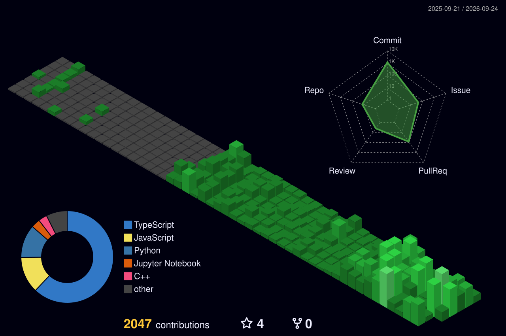

<!--
  The block between the nexus:start and nexus:end markers below is written
  automatically once a day by an agent of mine. It owns everything inside
  the markers, including the heading, and nothing outside them.
  Edit the rest of this file by hand.
-->

 

### 🌐 [Portfolio](https://r1ckshot.github.io/Portfolio/) &nbsp;·&nbsp; 📫 [kapusticnyk.com@gmail.com](mailto:kapusticnyk.com@gmail.com)

---

## 🧠 How I Work

Four questions, before any code.

<table align="center">
<tr>
<td align="center" width="50%"><b>Delegation</b> what a model should do at all</td>
<td align="center" width="50%"><b>Description</b> specified so a wrong answer shows</td>
</tr>
<tr>
<td align="center"><b>Discernment</b> how I catch a wrong output</td>
<td align="center"><b>Diligence</b> what must never happen, ever</td>
</tr>
</table>

 

*Not slogans — the actual section headings of the rules I keep in every repo's `CLAUDE.md`.*

 

**Control at both ends** — hooks block a forbidden write *before* it happens. 
Code decides what may be published, not the model's judgement.

---

## 🚀 Selected Work

<table align="center">
<tr>
<td align="center" width="50%"><b><a href="https://github.com/r1ckshot/tax-navigator">tax-navigator</a></b> free questionnaire comparing tax setups across two countries' systems</td>
<td align="center" width="50%"><b><a href="https://github.com/r1ckshot/YagodaKarpat">YagodaKarpat</a></b> production website for a family blueberry estate</td>
</tr>
<tr>
<td align="center">verbatim user quotes, 12 domain events, 5 bounded contexts, ADRs, phase gates</td>
<td align="center">live, in use, maintained</td>
</tr>
</table>

 

*Some of what I build is private — including systems that run unattended against real money.* 
*Glad to talk about how they are engineered. I don't publish them.*

---

<!-- nexus:start -->
<!-- date: 2026-08-25 -->
## 📝 Today

*Written daily by my agent — code decides what gets published.*

Psalm 104:32 He looketh on the earth, and it trembleth: he toucheth the hills, and they smoke.

Today: private work in agent tooling, documentation, and research, plus other work.
<!-- nexus:end -->

## 💻 Stack & Activity

Broad knowledge of many tools, depth in few — on purpose. 
I'd rather find what a project needs, then use Claude to build it and to learn it.

 

 

**Beyond the languages in the chart below**

 

  

  

